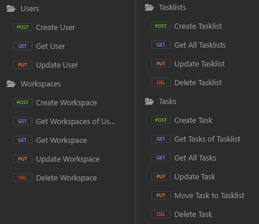

# Final Project (Oct. 12 - Oct 31)
This is going to serve as a planning reference for my project. I am planning to work on a **Project
Management Tool**. I am going to build a Spring Boot Application that will implement an API which will
get data from a mySQL Local Server and provide them to my React App to display.

## Core Functionality > Back-end: API Side
I am going to focus first on building some core aspects of the project and if these are done and 
there is still time left, then I will move on into extending this functionality. My first focus is
to be able to have a user create a workspace where he can organise the progress of his project using
task lists and tasks.

### ER Diagram
A user has an email, a password and a display name. A user can have one workspace. A workspace has a 
name and a due date for its project. A workspace can contain many task lists. A task list has a name 
and a position. Each task list consists of different tasks. A task has a name, a position and a description.
  

### API Spec
#### Users
- POST /users   Create a new user.
- GET /users/{id}   Get a specific user by his id.
- PUT /user/{id}   Update user's display name by his id.
#### Workspaces
- POST /users/{id}/workspaces   Create a new workspace for the user of this id.
- GET /users/{id}/workspaces   Get a user's workspaces by his id.
- GET /workspaces/{id}   Get a workspace by its id.
- PUT /workspaces/{id}   Update a workspace by its id.
- DELETE /workspaces/{id}   Delete a workspace by his id.
#### Tasklists
- POST /workspaces/{id}/tasklists   Create a new tasklist for the workspace of this id.
- GET /workspaces/{id}/tasklists   Get all tasklists of a workspace by its id.
- PUT /tasklists/{id}   Update a tasklist by its id.
- DELETE /tasklists/{id}   Delete a tasklist by its id.
#### Tasks
- POST /tasklists/{id}/tasks   Create a new task for the tasklist of this id.
- GET /tasklists/{id}/tasks   Get all tasks of a tasklist by its id.
- GET /tasks   Get all tasks.
- PUT /tasks/{id}   Update a task by its id.
- PUT /tasks/{id}/move/{tasklistId}   Move task of id to tasklist of tasklistId.
- DELETE /tasks/{id}   Delete a task by its id.
  

### Plan with Hive
I am going to use Hive to manage the progress of my project. This way I can be more organised about
the planning process and at the same time experiment live with a tool similar to what I am developing.
  
Example:

