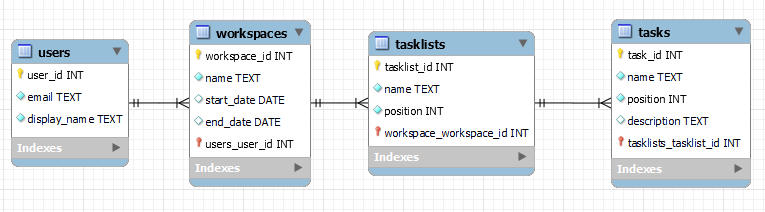

# Final Project (Oct. 12 - Oct 31)
This is going to serve as a planning reference for my project. I am planning to work on a Project
Management Tool. I am going to build a Spring Boot Application that will implement an API which will
get data from a mySQL Local Server and provide them to my React App.

## Core Functionality
I am going to focus first on building some core aspects of the project and if these are done and 
there is still time left, then I will move on into extending this functionality.

### Front-End
The primary focus will be to develop a user interface that will resemble the looks and some of the
core functionality of a tool like Hive.
   
 
  
Alternatively some of the UI or functionality can also resemble a tool like Teamwork.
  

  
If there is plenty of time the desired end-goal could be something that resembles a tool like Trello.
  

### ER Diagram
A user has an email, a username and a password. A user can have one workspace. A workspace has a name.
A workspace can contain many task lists. A task list has a name and an order. Each task list consists
of different tasks. A task has a name, a description and an order.
  

### API Spec
#### Users
- POST /users   Create a new user.
- GET /users/{id}   Get a specific user by his id.
#### Workspaces
- POST /users/{id}/workspaces   Create a new workspace for the user of this id.
- GET /users/{id}/workspaces   Get the workspace of a user by his id.
- PUT /users/{id}//workspaces   Update the workspace of a user by his id.
- DELETE /users/{id}/workspaces   Delete the workspace of a user by his id.
#### Tasklists
- POST /workspaces/{id}/tasklists   Create a new tasklist for the workspace of this id.
- GET /workspaces/{id}/tasklists   Get all tasklists of a workspace by its id.
- PUT /tasklists/{id}   Update a tasklist by its id.
- DELETE /tasklists/{id}   Delete a tasklist by its id.
#### Tasks
- POST /tasklists/{id}/tasks   Create a new task for the tasklist of this id.
- GET /tasklists/{id}/tasks   Get all tasks of a tasklist by its id.
- PUT /tasks/{id}   Update a task by its id.
- DELETE /tasks/{id}   Delete a task by its id.
  

### Plan with Hive
I am going to use Hive to manage the progress of my project. This way I can be more organised about
the planning process and at the same time experiment live with a tool similar to what I am developing.
  
Example:

